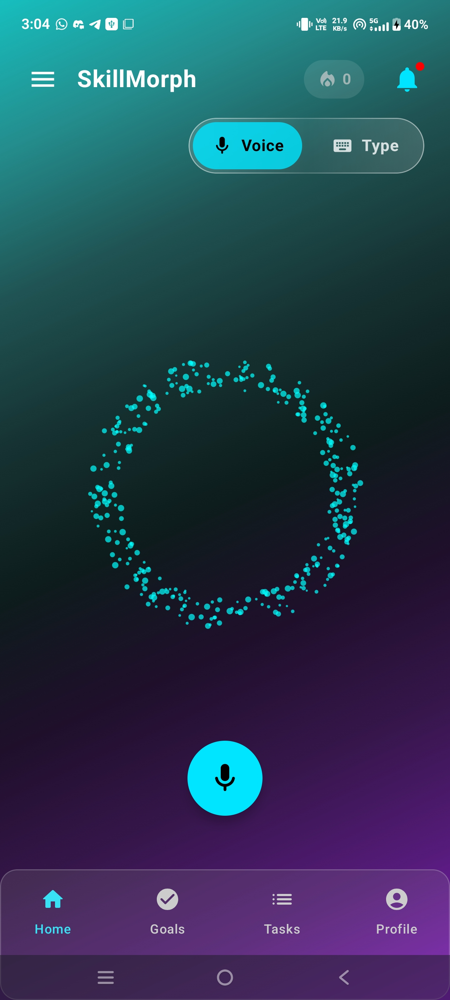
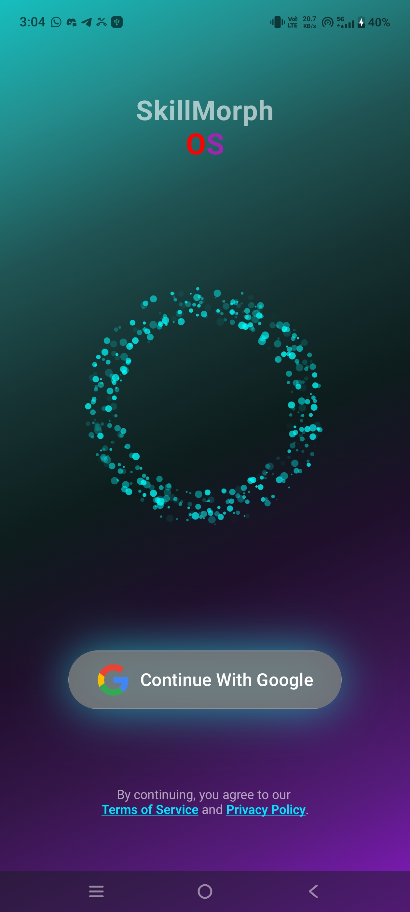
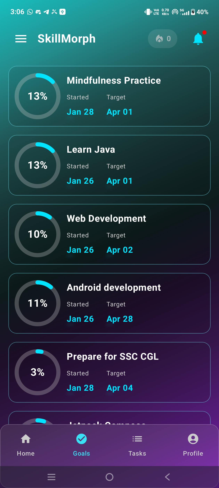
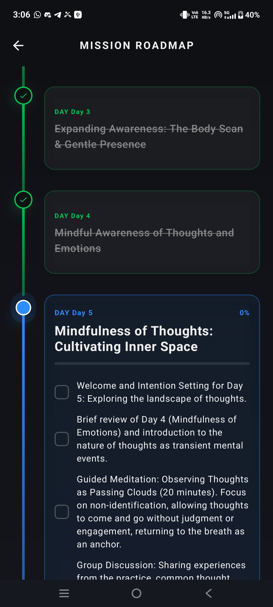
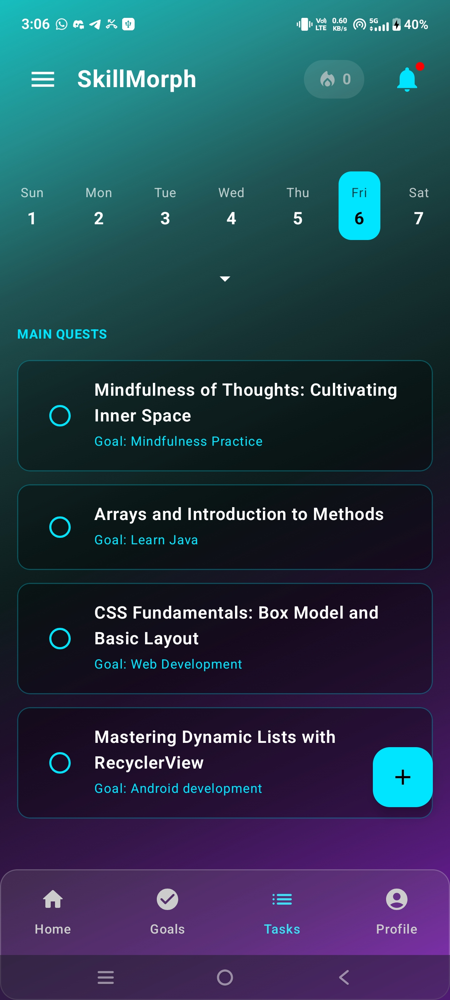
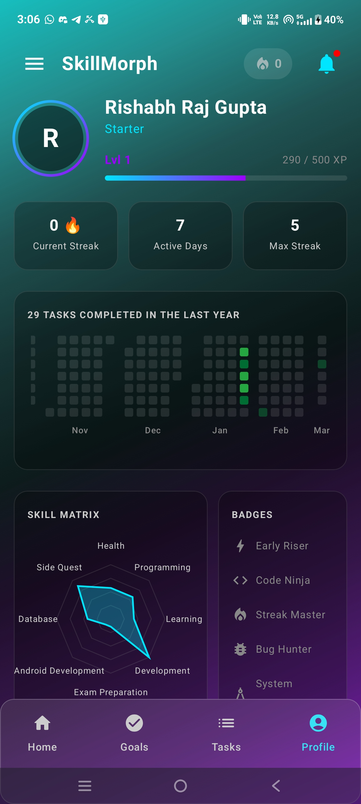
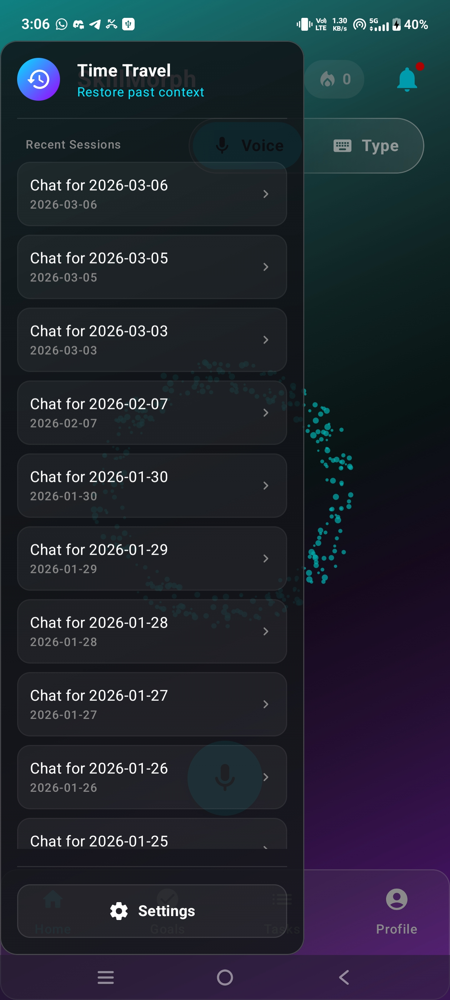

<div align="center">

# 🧠 SkillMorph OS

### *Your AI-Powered Learning Operating System*

**Tell the AI what you want to learn. It builds the curriculum, schedules it, and coaches you through it — every single day.**

[](https://kotlinlang.org)
[](https://developer.android.com/jetpack/compose)
[](https://fastapi.tiangolo.com)
[](https://langchain-ai.github.io/langgraph/)
[](https://deepmind.google/technologies/gemini/)
[](https://neo4j.com)
[](https://qdrant.tech)
[](https://firebase.google.com)
[](https://aws.amazon.com/lambda/)
[](#)

</div>

---

<div align="center">
  
  <br/>
  <em>Voice-first AI coaching interface with animated particle ring</em>
</div>

---

## 💡 Why I Built This

Every year, millions of people set ambitious learning goals — *"Learn Python"*, *"Master Data Structures"*, *"Prepare for competitive exams"* — and almost all of them fail. Not because they lack motivation, but because they lack **structure**. They don't know *what* to study on Day 1 vs. Day 30, they can't track progress meaningfully, and there's no one to keep them accountable.

**SkillMorph solves this by turning AI from a chatbot into a personal curriculum architect.**

You don't browse courses. You don't build spreadsheets. You simply **tell the AI what you want to learn**, and it:
- 🗺️ Generates a complete, day-by-day roadmap with subtasks
- 📅 Schedules your learning across all your goals into a unified daily task view
- 🔄 **Adapts to your pace** — missed a day? No guilt, no red alerts. The timeline shifts forward. Did 2 days in one sitting? It *shrinks* your projected end date
- 🤖 Coaches you via a voice-first conversational interface that remembers context across sessions
- 🏆 Gamifies your progress with XP, levels, streaks, skill radar, and achievement badges

It's not just an app — it's an **operating system for skill acquisition**.

---

## ✨ Features & Visual Walkthrough

### 🔐 One-Tap Authentication
<div align="center">
  
</div>

Secure, frictionless authentication via **Google Sign-In** using Android's modern Credential Manager API, backed by **Firebase Auth**. The animated particle ring isn't just decoration — it's a custom Jetpack Compose Canvas animation that sets the tone for the entire experience.

---

### 🎯 AI-Generated Learning Roadmaps
<div align="center">
  
</div>

Create a goal like *"Learn Java"* or *"Prepare for SSC CGL"*, and the **Gemini-powered AI** instantly generates a structured multi-week curriculum. Each goal card shows real-time progress with circular indicators, and a **dynamically projected end date** — not a fixed deadline, but a live calculation of `today + remaining days` that adapts as you work. Skip a day? The end date shifts forward. Crush two days in one? It shrinks.

---

### 🚇 Metro Map — Your Learning Journey Visualized
<div align="center">
  
</div>

This is the centerpiece of SkillMorph. Each goal expands into a **metro/subway-style roadmap** — a custom Compose Canvas visualization where:
- ✅ **Green stations** = completed days (with strikethrough text)
- 🔵 **Cyan station** = today's active lesson (expanded with subtask checkboxes)
- ⚪ **Gray stations** = locked future content

The timeline is **fully adaptive** — days are not pinned to calendar dates. If you miss a day, the current station simply waits for you. If you complete two stations in one sitting, the next one unlocks immediately, and the projected end date shrinks. The AI pre-generates content for upcoming days in the **background**, so there's always fresh material waiting.

---

### 📋 Unified Daily Task View
<div align="center">
  
</div>

All your goals converge into one daily view. The **Tasks screen** aggregates today's scheduled learning sessions across every active goal, plus any **Side Quests** (custom one-off tasks). Under the hood, a **pacing engine** calculates which task to show per goal based on your completion velocity — with a built-in cooldown that spaces out tasks to prevent burnout. A horizontal calendar strip lets you peek at upcoming days, each recalculated dynamically.

---

### 🏆 Gamified Profile & Skill Matrix
<div align="center">
  
</div>

Learning should feel like leveling up. The Profile screen computes **everything in real-time** from the knowledge graph:
- **XP & Levels:** 50 XP per goal-day, 30 XP per side quest → Level tiers from *Starter* to *Legend*
- **Streaks:** Current + max streak with 🔥 fire indicator
- **GitHub-Style Heatmap:** 365-day contribution grid, computed from completion timestamps
- **Skill Matrix:** Radar chart mapping competency across goal categories
- **Achievement Badges:** Dynamically awarded (*Early Riser*, *Code Ninja*, *Streak Master*, *Bug Hunter*) based on activity patterns

---

### 💬 Time Travel — Chat History
<div align="center">
  
</div>

Every conversation with the AI is preserved as a dated session in Neo4j. The **Time Travel sidebar** lets you revisit any past coaching session — restoring full conversational context. Sessions use a **"3:30 AM Rule"**: the day boundary is at 3:30 AM, not midnight, so late-night learners stay in the same session naturally.

---

## 🏗️ Architecture Deep Dive

SkillMorph is a **full-stack AI-native application** with a clear separation between a Kotlin/Compose frontend and a Python/LangGraph backend:

```
┌────────────────────────────────────────────────────────────────┐
│                    ANDROID CLIENT (Kotlin)                      │
│  ┌──────────┐   ┌───────────┐   ┌──────────────────────────┐  │
│  │ Compose  │──▶│ ViewModels│──▶│ Repositories             │  │
│  │ Screens  │   │ (StateFlow)│  │ ├─ Retrofit (Remote)     │  │
│  │ (M3 UI)  │   └───────────┘   │ └─ Room (Local Cache)    │  │
│  └──────────┘                    └──────────────────────────┘  │
│       │              Hilt DI │         OkHttp + AuthInterceptor│
│       │     (x-user-id: firebase_uid in every request)         │
└───────┼────────────────────────────────────────────────────────┘
        │ HTTPS/JSON
        ▼
┌────────────────────────────────────────────────────────────────┐
│                 PYTHON BACKEND (AWS Lambda Container)          │
│  ┌─────────────────────────────────────────────────────────┐   │
│  │              FastAPI REST Layer                          │   │
│  │  /goals  /tasks  /agent/chat  /chat/sessions  /memory   │   │
│  └────────────────────────┬────────────────────────────────┘   │
│                           │                                     │
│  ┌────────────────────────▼────────────────────────────────┐   │
│  │          LangGraph AI Agent (State Machine)              │   │
│  │                                                          │   │
│  │   agent_node ──[tools?]──▶ tool_node ──▶ synthesizer    │   │
│  │       │                       │               │          │   │
│  │   Gemini 2.0              7 Custom         Gemini 2.0   │   │
│  │   Flash LLM              Tools             Flash LLM    │   │
│  └──────────────────────────────────────────────────────────┘   │
│                           │                                     │
│  ┌────────────────────────▼────────────────────────────────┐   │
│  │               Service Layer                              │   │
│  │  ┌─────────────┐ ┌──────────────┐ ┌──────────────────┐  │   │
│  │  │  Neo4j Aura │ │ Qdrant Cloud │ │ Gemini Embeddings│  │   │
│  │  │ (Knowledge  │ │   (Semantic  │ │  (Vector Memory) │  │   │
│  │  │   Graph)    │ │    Memory)   │ │                  │  │   │
│  │  └─────────────┘ └──────────────┘ └──────────────────┘  │   │
│  └──────────────────────────────────────────────────────────┘   │
└────────────────────────────────────────────────────────────────┘
```

### Key Architectural Decisions

| Decision | Why |
|---|---|
| **Neo4j over SQL** | Learning journeys are inherently graph-structured: Users → Goals → Days → Subtasks. Graph traversals (e.g., "get all today's tasks across all goals") are single Cypher queries vs. complex SQL joins. |
| **LangGraph over raw LLM calls** | The AI needs to reason about *when* to use tools (check goals, mark completions, search memory). LangGraph's state machine gives deterministic control flow with conditional routing. |
| **Qdrant for Memory** | Semantic search over past context enables true RAG — the AI "remembers" what users discussed weeks ago, not just the current session. |
| **Gemini Key Rotation** | Multiple API keys with round-robin rotation prevent rate limiting during peak usage. |
| **Floating Timeline (No Fixed Dates)** | Only Day 1 has a calendar date. All other days are "floating" — the pacing engine dynamically calculates which day to show based on completion state, not a rigid calendar. This is why missing a day has zero penalty and the end date auto-adjusts. |
| **Virtual Date ("3:30 AM Rule")** | Real users study late at night. A midnight boundary would split a single study session into two days, breaking streak calculations. |

---

## 🚀 Quick Start

### Prerequisites
- **Android Studio** Hedgehog (2023.1.1) or later
- **Python** 3.11+
- **Docker** (optional, for containerized backend)
- **Neo4j Aura** account (free tier works)
- **Qdrant Cloud** account (free tier works)
- **Google Cloud** account (for Gemini API keys)
- **AWS** account (for Lambda deployment, optional for local dev)
- **Firebase** project (for Authentication)

### 1. Clone the Repository
```bash
git clone https://github.com/RishabhRajGupta/SkillMorph.git
cd SkillMorph
```

### 2. Backend Setup
```bash
cd backend

# Create and configure environment
cp .env.example .env
# Edit .env with your Neo4j, Qdrant, and Gemini credentials

# Install dependencies
pip install -r requirements.txt

# Run the server
uvicorn app.main:app --host 0.0.0.0 --port 8080 --reload
```

**Or with Docker (mirrors production Lambda container):**
```bash
docker build -t skillmorph-backend .
docker run -p 8080:8080 --env-file .env skillmorph-backend
```

### 3. Android Setup
1. Open the `SkillMorph/` root directory in **Android Studio**.
2. Add your `google-services.json` from Firebase Console to `app/`.
3. Update `local.properties`:
   ```properties
   BASE_URL=http://10.0.2.2:8080  # For emulator (or your Cloud Run URL)
   ```
4. Sync Gradle and run on a device/emulator (min SDK 26).

### 4. Verify
- Open the app → Sign in with Google → Create a goal → Watch the AI generate your roadmap! 🎉

---

## 📁 Project Structure

```
SkillMorph/
├── app/                              # 📱 Android Module
│   └── src/main/java/.../skillmorph/
│       ├── di/                       # Hilt DI Modules
│       ├── data/                     # Room DB + Retrofit API + Repos
│       ├── domain/                   # Repository Interfaces
│       ├── presentation/             # Compose Screens + ViewModels
│       │   ├── auth/                 # Google Sign-In
│       │   ├── main/                 # Voice/Type Home + Daily Briefer
│       │   ├── goals/                # Goals Dashboard
│       │   ├── tasks/                # Daily Task Aggregator
│       │   ├── Profile/              # Gamification (XP, Streaks, Badges)
│       │   ├── goaldetail/           # Metro Map Roadmap
│       │   └── navigation/           # App Navigation
│       └── ui/theme/                 # Material 3 Theming
│
├── backend/                          # 🐍 Python Backend
│   ├── app/
│   │   ├── agent/                    # LangGraph AI Agent
│   │   ├── core/                     # Config + API Key Management
│   │   ├── schemas/                  # Pydantic Models
│   │   ├── services/                 # Neo4j, Qdrant, LLM, Chat Services
│   │   └── main.py                  # FastAPI Entry Point
│   ├── Dockerfile                    # Cloud Run Deployment
│   └── requirements.txt
│
├── UI/                               # 📸 App Screenshots
└── PROJECT_CONTEXT.md                # 📋 Technical Reference
```

---

## 🛠️ Tech Stack at a Glance

| Layer | Technologies |
|---|---|
| **Mobile** | Kotlin · Jetpack Compose · Material 3 · Hilt · Room · Retrofit · WorkManager |
| **Backend** | Python · FastAPI · LangGraph · LangChain |
| **AI/ML** | Google Gemini 2.0 Flash · Gemini Embeddings · RAG Pipeline |
| **Databases** | Neo4j Aura (Graph) · Qdrant Cloud (Vector) · Firebase Firestore |
| **Auth** | Firebase Auth · Google Credential Manager |
| **Infrastructure** | AWS Lambda (Container) · Docker · Amazon ECR · Uvicorn |

---

## 📄 License

This project is built for educational and portfolio purposes.

---

<div align="center">

**Built with 🔥 by [Rishabh Raj Gupta](https://github.com/RishabhRajGupta)**

*If this project inspired you, consider giving it a ⭐*

</div>
